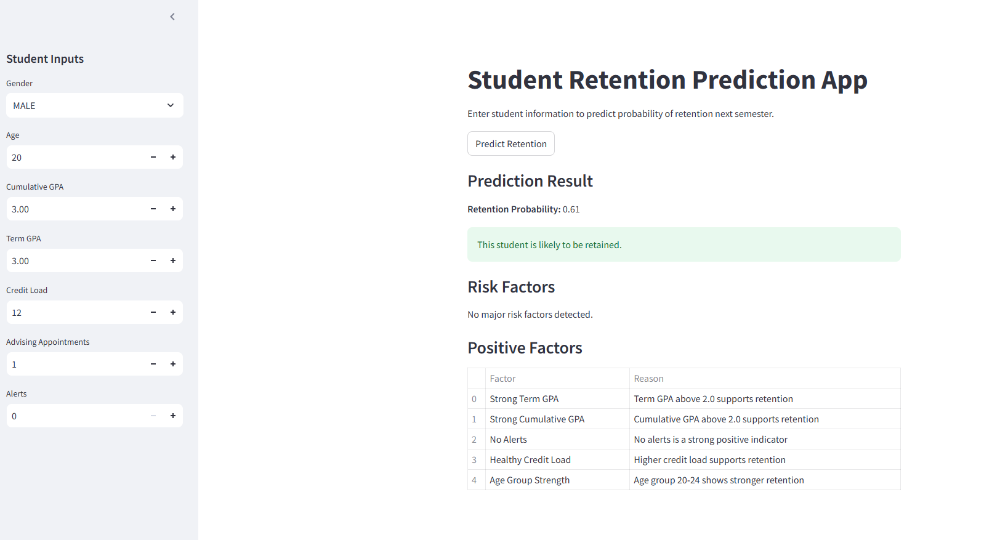
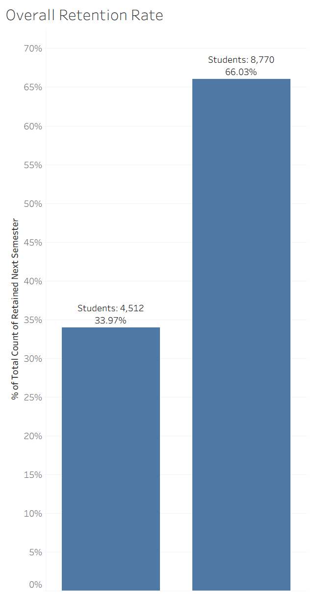
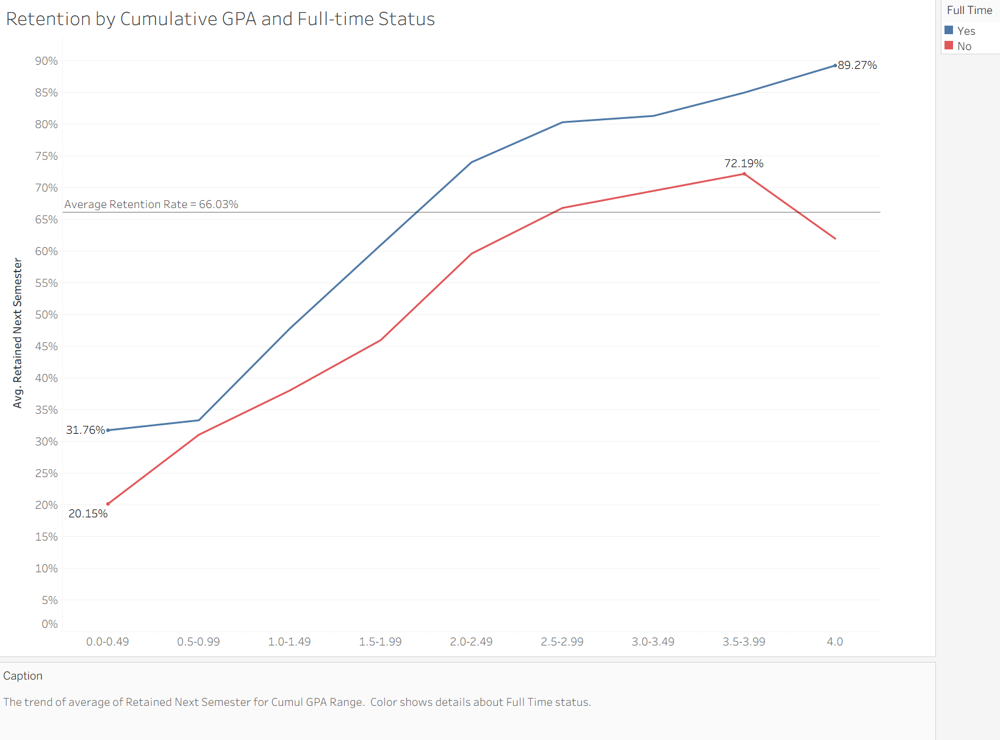
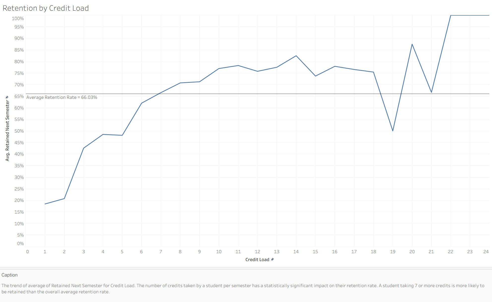

# Student Retention Prediction Dashboard

This project builds a machine learning model to predict student retention using institutional data and presents the results through an interactive Streamlit dashboard. The app provides retention probability, risk factors, and protective factors based on GPA, alerts, advising engagement, credit load, and demographic information.

---

## Project Overview
Student retention is a critical metric for colleges and universities. This project uses logistic regression to identify patterns associated with retention and provides an explainable interface for advisors, faculty, and administrators.

The goal is to:
- Identify students who may be at risk of not returning
- Highlight actionable risk factors
- Support early intervention and advising strategies
- Demonstrate applied machine learning skills in a real-world context

## Dataset
This project was built using 13,567 anonymized student-term observations collected from a Student Information System (SIS) and EAB Navigate.
To protect student privacy, all student identifiers and institutional identifiers were removed prior to analysis.
Variables included:
- Cumulative GPA
- Term GPA
- Credit Load
- Full-Time Status
- Advising Appointments
- No-Shows
- Alerts
- Age Group
- Gender
- Major Category
- Retained Next Semester

## Streamlit App
The interactive dashboard allows users to:
- Input student information through sidebar controls
- Generate a retention probability using a trained ML model
- View risk factors and protective factors in clean, advisor-friendly tables
- Understand *why* the model made its prediction

The app is designed for deployment on **Streamlit Cloud**.

[Launch the Streamlit App](https://studentretention-prh2cmrdhpqjjap9ng39cd.streamlit.app/) 
## Application Preview
### Student Retention Prediction Tool

---

## Model Details
A logistic regression model was trained using institutional student data.  
Key features include:

- **Cumulative GPA**
- **Term GPA**
- **Advising Appointments**
- **Alerts**
- **Credit Load**
- **Age Group (binned)**
- **Gender**
- **Full-Time Status (calculated internally from credit load)**

The model is serialized using `joblib` and loaded directly inside the Streamlit app.

## Exploratory Data Analysis & Visualizations
The following visualizations were developed to explore factors associated with student retention and to identify patterns later incorporated into the predictive model.
### Overall Retention Rate

**Finding:** Approximately 66% of student-term observations were retained to the following primary semester.

---
### Retention by Cumulative GPA and Full-Time Status

**Finding:** Retention increased substantially as cumulative GPA increased. Full-time students consistently demonstrated higher retention rates than part-time students across nearly all GPA ranges.

---
### Retention by Credit Load

**Finding:** Students enrolled in higher credit loads generally demonstrated stronger retention outcomes.

---

##  Technologies Used
- Python
- pandas
- numpy
- scikit-learn
- Streamlit
- joblib
- Excel (data cleaning and preprocessing)
- Tableau (data visualization and dashboard development)

## Model Performance
Performance metrics will be added as model evaluation is finalized.
Planned metrics include:
- Accuracy
- Precision
- Recall
- F1 Score
- ROC-AUC
- Confusion Matrix
  
## Future Enhancements:
- Interactive Tableau dashboards
- Major Category retention analysis
- Additional exploratory visualizations
- ROC curve and confusion matrix
- Feature importance visualizations
- Enhanced project documentation

Screenshots and links to Tableau dashboards will be added as this project continues to evolve.

I will continue updating this repository as new features and visualizations are completed. 

## Environment
Python 3.11
Dependencies are listed in requirements.txt.

## Contact
Created by Sydney Clapperton  
For questions or collaboration, feel free to reach out via GitHub.
